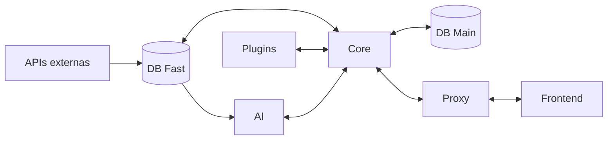

# Plataforma de Comando Operacional Unificado e Inteligência Preditiva para Gestão de Crises e Emergências

Projeto em Engenharia Informática (43675) · Licenciatura em Engenharia Informática · Universidade de Aveiro · 2026/2027

## Resumo

Plataforma de comando e controlo orientada à gestão de grandes eventos, segurança pública e resposta a crises.
Faz a fusão de dados heterogéneos em tempo real numa interface *Common Operational Picture* (COP) unificada
e usa IA preditiva para antecipar riscos e recomendar a afetação de meios.

## Objetivos

- Ecossistema de dados unificado (dados abertos e feeds em tempo real)
- Motor de IA preditiva com dados sintéticos
- Interface COP de baixa latência
- Recomendação tática de meios
- Arquitetura modular *dual-use* (civil e defesa)

## Arquitetura (rascunho)

## Equipa

| Nome | NMEC | Contacto |
|---|---|---|
| Fernando Santos | 124808 | email@ua.pt |
| Miguel Neto | 125200 | email@ua.pt |
| Diogo Silva | 125240 | email@ua.pt |
| Guilherme Martins | 125260 | email@ua.pt |
| Bernado Reis | 126004 | email@ua.pt |

## Orientação

- Fábio Coutinho
- Ricardo Figueiredo
- Advisors: Arnaldo Oliveira, Nuno Borges de Carvalho

!!! note "Estado do projeto"
    Fase atual: **Inception (MS1)**.

## Ligações

- [Código no GitHub](https://github.com/ORG)
