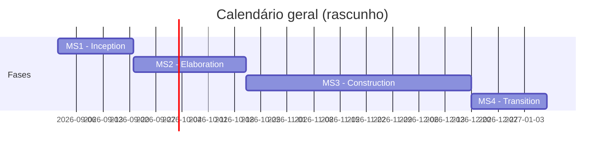

# Calendário Geral do Projeto

!!! note "Estado"
    :construction: Rascunho — por preencher.

Visão de alto nível do calendário do projeto ao longo das quatro milestones (Inception, Elaboration, Construction, Transition). Para o detalhe de tarefas de cada fase, ver a página "Calendário do projeto" dentro de cada milestone.

