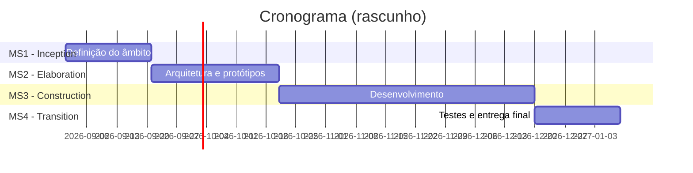

# Calendário do Projeto

!!! note "Estado"
    :construction: Rascunho — por preencher.

## Lista de tarefas

<!-- Lista de tarefas identificadas, agrupadas por módulo. -->

## Cronograma

<!-- Data limite do projeto e principais marcos temporais. Atenção a eventos como o Students@DETI. -->

## Marcos (Milestones)

| # | Descrição | Data prevista |
|---|---|---|
| MS1 | Inception | |
| MS2 | Elaboration | |
| MS3 | Construction | |
| MS4 | Transition | |

## Entregáveis

<!-- Pacotes de software, relatórios, apresentações, etc. -->

- Entregável 1
- Entregável 2
